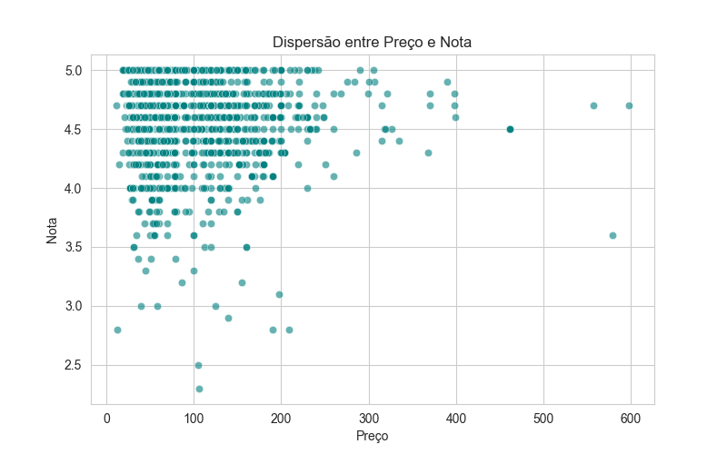
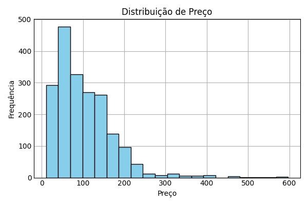

## Sumário

- [Objetivo](#-objetivo)
- [Tecnologias](#-tecnologias-utilizadas)
- [Estrutura](#-estrutura-do-projeto)
- [Exemplos de Gráficos](#-exemplos-de-gráficos)
- [Insights Possíveis](#-insights-possíveis)
- [Como Executar](#-como-executar)
- [Dataset](#-dataset-(recomenda-se-usar-um-ambiente-virtual))
- [Autor](#-autor)
- [Licença](#-licença)


# 📊 Análise Exploratória Gráfica — E-commerce

Este repositório contém um conjunto de gráficos gerados com **Python**, utilizando as bibliotecas `Seaborn`, `Matplotlib` e `Pandas`, para análise exploratória de dados de um dataset de produtos de e-commerce.

## 🎯 Objetivo

Explorar visualmente relações entre variáveis como:

- Preço
- Nota dos produtos
- Número de avaliações
- Frequência por marca e material
- Correlações entre variáveis numéricas

Com o intuito de entender padrões, comportamentos e relações entre atributos do dataset.

---

## 🧰 Tecnologias utilizadas

- Python 3.13
- Pandas
- Matplotlib
- Seaborn
- PyCharm

---

## 📁 Estrutura do Projeto
```
ecommerce_gráficos/
│
├── img/                      
├── plot_types_python/         # Exemplos de diferentes tipos de gráficos matplotlib
├── Dash_ecommerce.py          # Versão futura interativa do dashboard
├── ecommerce_preparados.csv   # Dataset tratado para análise
├── Plt_gráficos.py            # Script para geração de gráficos com Matplotlib
├── Sns_gráficos.py            # Script para geração de gráficos com Seaborn
└── README.md                  # Este arquivo

yaml
````
---

## 📊 Exemplos de Gráficos

### ✅ Histograma Produtos e quantidades por marca
A quantidade de produtos influencia diretamente os resultados.


### Faixa de preços de 50 a 250 são os mais populares.

 

### ✅ Gráfico de Dispersão: Preço vs Nota
Avalia possível correlação entre preço e avaliação dos produtos.




### ✅ Mapa de Calor
Mostra a correlação entre variáveis numéricas como preço, avaliações e vendas.


```
Correlação entre variáveis numéricas do dataset.
Notamos uma forte correlação positiva. Nele,  entre o número de avaliações e a quantidade de produtos vendidos (0.90).
Isto indica que produtos mais avaliados também são os mais vendidos ou vise versa.
Além disso, há uma correlação negativa moderada entre o tipo de material e o preço (-0.49),sugerindo que certos materiais estão associados a produtos de menor valor.
Outros pontos relevantes incluem uma correlação fraca, porém positiva, entre desconto e nota,o que pode indicar maior satisfação dos clientes em compras com desconto.
Este mapa ajuda a identificar padrões que podemser usados em análises preditivas e estratégias de vendas mais eficientes.
```

### ✅ Gráfico de Barras
Frequência de produtos por marca e por material.

 

### ✅ Gráfico de Pizza com Agrupamento de “Outros”
Exibe a distribuição de materiais, agrupando os menos frequentes em “Outros”.


### ✅ Gráfico de Regressão Linear
Visualiza tendência entre número de avaliações e preço do produto.


```
Regressão Linear: Preço vs Número de Avaliações

O gráfico apresenta uma regressão linear entre o preço dos produtos e o número de avaliações recebidas.
Apesar da linha de tendência crescente, indicando uma leve correlação positiva, a dispersão dos pontos
revela uma alta variabilidade: muitos produtos baratos possuem alto número de avaliações, enquanto produtos
 caros tendem a ter poucas avaliações.
Isso sugere que o preço por si só não é um fator determinante na quantidade de avaliações — outros fatores,
como popularidade, qualidade percebida e promoção, podem influenciar mais significativamente. A regressão
ajuda a visualizar tendências gerais, mas não é suficiente para prever com precisão o comportamento individual.
```

## 📌 Insights Possíveis

- Produtos com **mais avaliações tendem a vender mais** (forte correlação).
- **Preço** não tem forte correlação com **nota média**, indicando que produtos baratos podem ser bem avaliados.
- Gráficos ajudam a identificar **marcas dominantes** e **materiais mais populares**.

---

## 🚀 Como executar

```bash
# Clone o repositório
git clone https://github.com/seu-usuario/ecommerce-graficos.git
```

# Dataset (recomenda-se usar um ambiente virtual)
```
pip install pandas matplotlib seaborn
Execute os arquivos .py diretamente no seu IDE (PyCharm ou VSCode)
```


# Autor
Johnny Sorato Martins Fernandes
Consultor de Negócios | Especialista em Dados e Visualização | Diretor Executivo da Tutoreanos - Unidade Primavera do Leste
